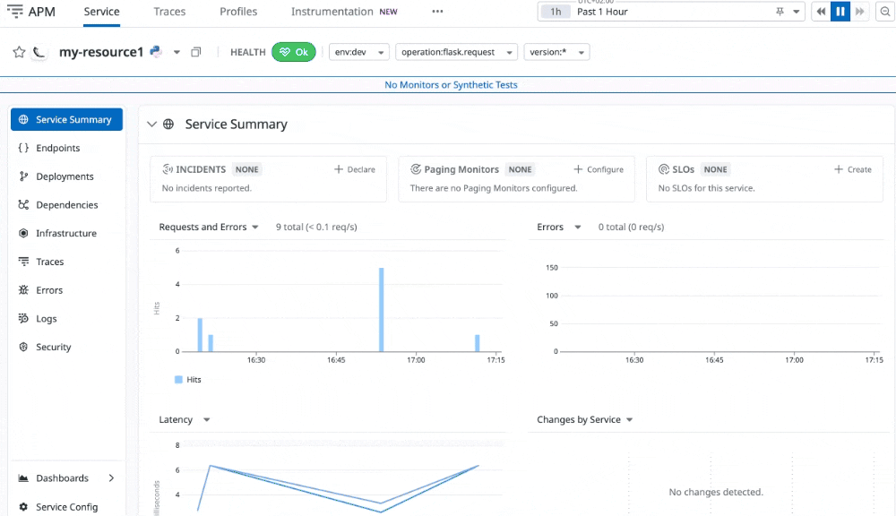

# datadog-apm

### Configuring the Datadog Agent
Check the config in the file 
`datadog-working-config-process-env.yaml`
### Running the code
Since Flask and Datadog agent both run by default on port `5000`, we change the flask app here to run on `4999` instead.
```
FLASK_APP=main.py DD_SERVICE="my-resource1" DD_LOGS_INJECTION=true ddtrace-run flask run --port=4999
```

You can see the output at `http://localhost:4999/predictions/` as seen here


And in Datadog Portal here
